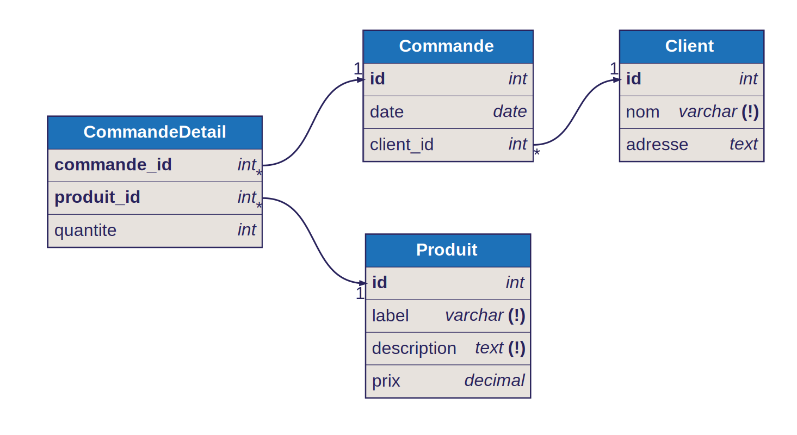

# Boutique en ligne

Ce projet présente la conception de la base de données d'une boutique en ligne.

## Fonctionnalités

- Génération du schéma aux formats SQL et SVG à partir d'un fichier DBML
- Génération de données de test avec Faker PHP
- Création de la base de données dans un SGBD
- Insertion des données dans la base de données

## Prérequis

Les logiciels suivants sont nécessaires pour exécuter ce projet :

- [Git](https://git-scm.com/)
- [PHP 8+](https://www.php.net/downloads.php)
- [Composer](https://getcomposer.org/)
- [NodeJS](https://nodejs.org/)
- [npm](https://www.npmjs.com/) (En général installé avec NodeJS)
- Un serveur de base de données [MySQL](https://www.mysql.com/), [MariaDB](https://mariadb.org/) ou [PostgreSQL](https://www.postgresql.org/)

## Installation

1. Cloner le dépôt
2. Installer les dépendances NodeJS avec `npm install`
3. Installer les dépendances PHP avec `composer install`
4. Dupliquer le fichier `.env.example` en `.env` à la racine du projet et ajoutez-y les informations de connexion à votre base de données
5. Exécuter le script `boutique-generate.php` pour générer le schéma de la base de données, les données de test et les insérer dans la base de données

```
git clone https://github.com/erralb-uga/boutique.git
cd boutique
npm install
composer install
cp .env.example .env
```

Modifier le fichier `.env` pour ajouter les informations de connexion à votre SGBD

```
php boutique-generate.php --dbml --generate --data
```

## Diagramme ERD

