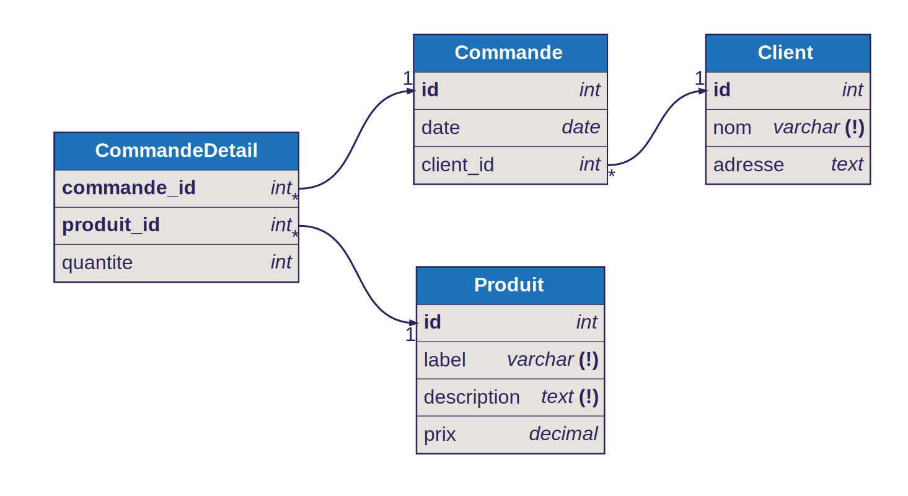

Ce document présente la conception d'une base de données pour une boutique en ligne.

# Énoncé

On souhaite informatiser une boutique en ligne. Les clients ont un numéro unique, un nom et une adresse. Les clients passent des commandes à une date donnée et les commandes sont identifiées par un numéro unique. Elles ont des lignes de détails qui référencent chaque produit commandé ainsi que la quantité commandée. Les produits sont identifiés par un numéro unique, ont un label, une description et un prix unitaire.

# Décomposition

## Propositions élémentaires

1. La boutique en ligne doit être informatisée.
2. Chaque client a un numéro unique.
3. Chaque client a un nom.
4. Chaque client a une adresse.
5. Les clients passent des commandes à une date donnée.
6. Chaque commande est identifiée par un numéro unique.
7. Les commandes contiennent des lignes de détails.
8. Chaque ligne de détail référence un produit commandé.
9. Chaque ligne de détail indique la quantité commandée.
10. Chaque produit est identifié par un numéro unique.
11. Chaque produit a un label.
12. Chaque produit a une description.
13. Chaque produit a un prix unitaire.

## Propositions retenues

2. Chaque client a un numéro unique.
3. Chaque client a un nom.
4. Chaque client a une adresse.
5. Les clients passent des commandes à une date donnée.
6. Chaque commande est identifiée par un numéro unique.
7. Les commandes contiennent des lignes de détails.
8. Chaque ligne de détail référence un produit commandé.
9. Chaque ligne de détail indique la quantité commandée.
10. Chaque produit est identifié par un numéro unique.
11. Chaque produit a un label.
12. Chaque produit a une description.
13. Chaque produit a un prix unitaire.

# Modèle conceptuel de données

## Entités

- Client
- Commande
- CommandeDetail
- Produit

## Associations

- Client - Commande
- Commande - CommandeDetail
- CommandeDetail - Produit

## Attributs

### Client

- id: int
- nom: string
- adresse: string

### Commande

- id: int
- date: date
- id_client: int

### CommandeDetail

- id_commande: int
- id_produit: int
- quantite: int

### Produit

- id: int
- label: string
- description: string
- prix: float

## Diagramme ERD

